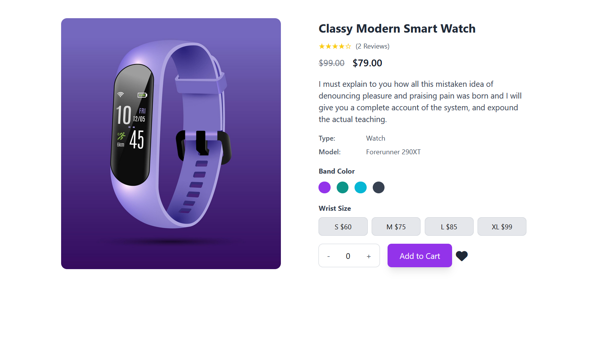

# 🛒 Add To Cart - E-commerce Product Page (HTML, Tailwind CSS & JS)

This is a responsive and interactive **Add To Cart** product detail page, built using **HTML**, **Tailwind CSS**, and **Vanilla JavaScript**. It allows users to select wrist sizes, choose colors, adjust quantity, and dynamically calculate the total.

🌐 **Live Preview:** [add-to-cart-khadizacoder.netlify.app](https://add-to-cart-khadizacoder.netlify.app/)

---

## 📸 Preview

---

## ✨ Features

- 🛍️ Product info display with title, price, description
- 🎨 Dynamic band color and size selection
- 💰 Real-time price calculation
- 📱 Fully responsive layout (mobile to desktop)
- ❤️ Wishlist/favorite button included

---

## 🛠️ Technologies Used

| Tech         | Description                    |
|--------------|--------------------------------|
| HTML5        | Markup structure               |
| Tailwind CSS | Styling & responsive design    |
| JavaScript   | Quantity logic & interactivity |

